# UniClub

## Date:12/9/2024

## website description :
UniClub Application is an app developed to allow the users to add channels for university courses, and add comments, posts, details related to each course in order to have a technical community in the university, that everyone can share their added comments, details, and posts with every student in the university.

## Instructions
Before the user signs up or signs in, he can only view the channels and the posts along with the post details in the website, then the user must sign up and then sign in, after that he can view all the added channels and posts along with their details, in addition, he can add channels, he also can add posts in all of the channels along with the details of the post. Finally he can add files and see the files added by the other users. Also, there is a feature that the user can view his profile in order to see his added posts, when he click on the post, it directly takes him to the post details of the post that he clicked on.

 [Deployment Link](https://uni-club-frontend.vercel.app/)

## user stories :

- As a user, I should be able to sign in and sign up.
- As a user, I should be able to create channels, and be a moderator. 
- As a user, I should be able to post in each channel.
- As a user, I should be able to add comments in each channel.
- As a user, I should be able to add  files "notes, slides, books, past exams.. etc"
- As a user, I should be able to view all the added comments and details for each course.
- As a user, I should be able to edit and delete the comments and posts that I added.

## Technologies used
* React for front-end
* JavaScript(express.js,node.js) for backend
* Heroku and vercel for deployment
* MongoDB for the database
* CSS for styling
* [Trello for planning](https://trello.com/b/PkImCtGH/uniclub)

## Screenshots
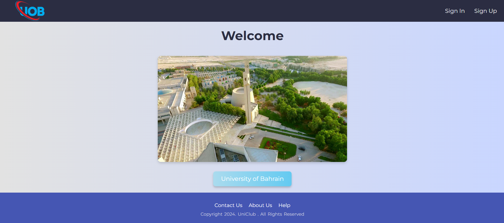
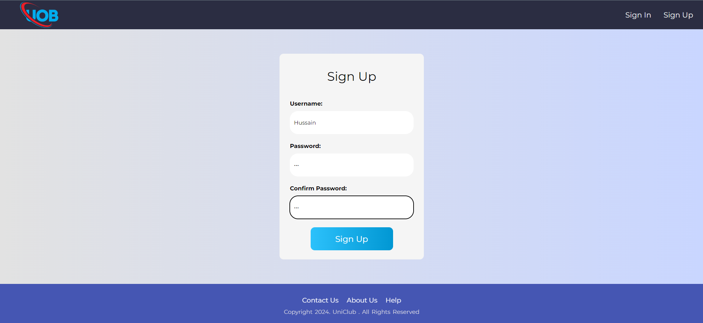
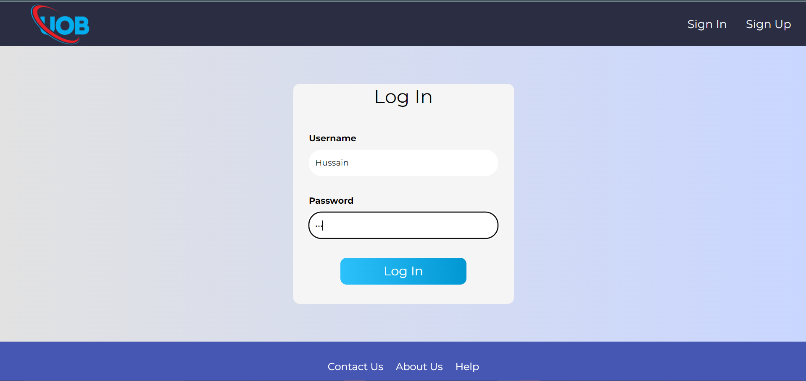

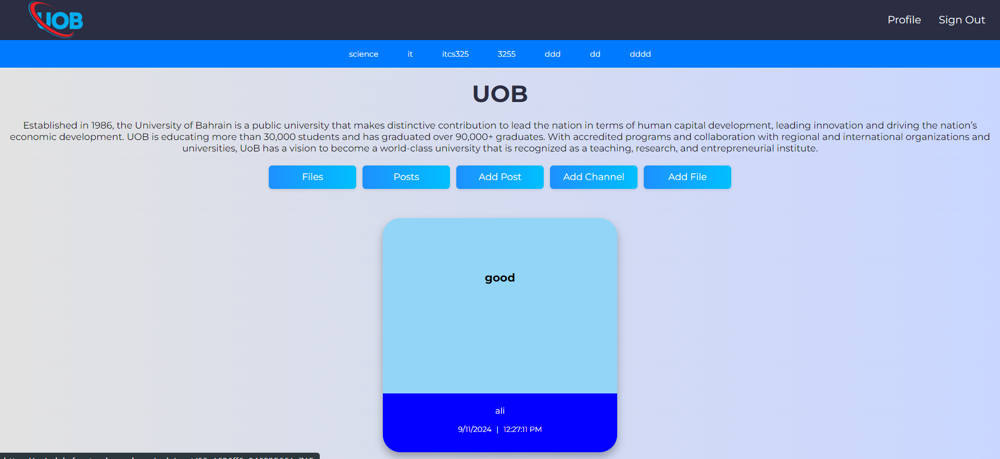
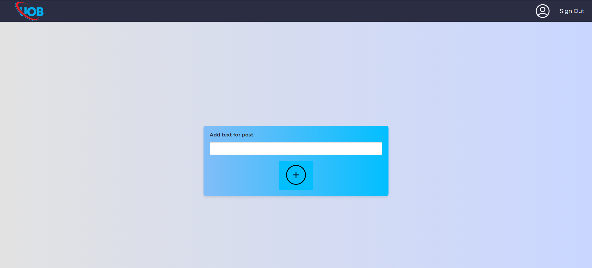
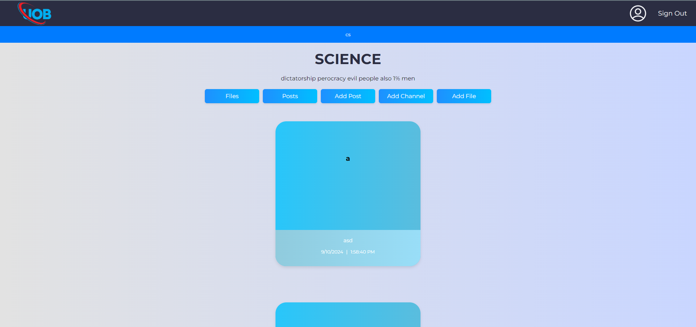
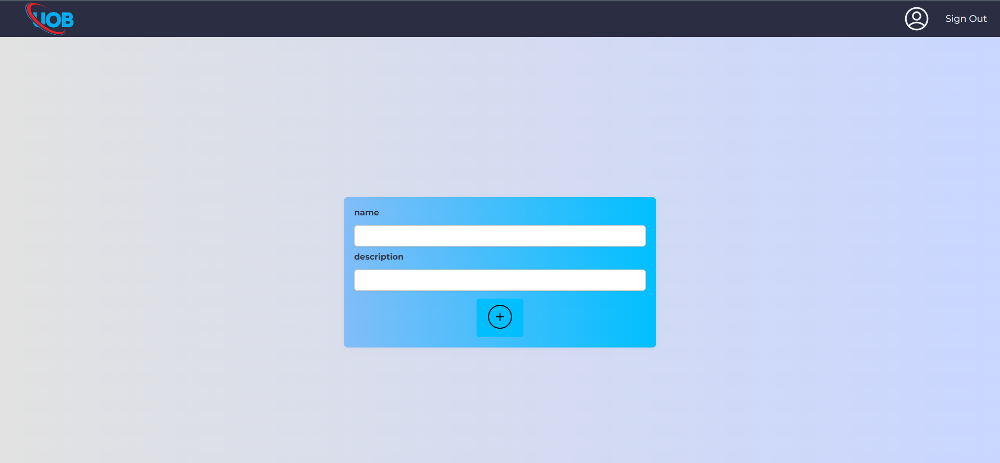
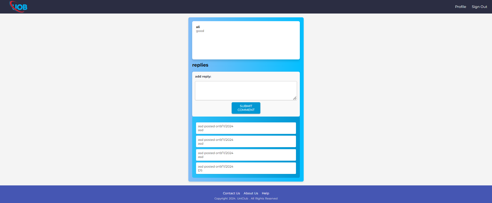
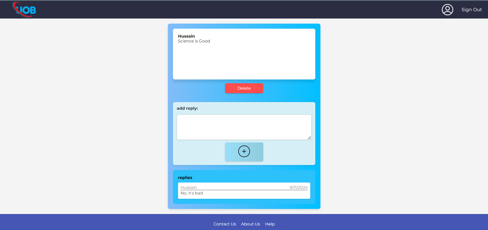
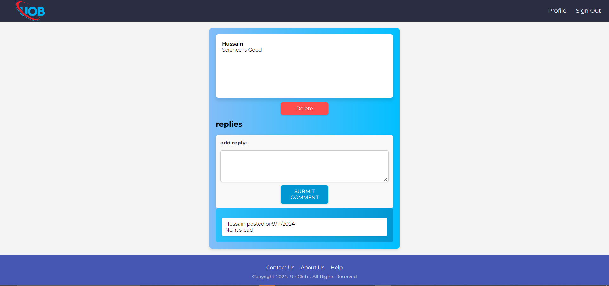
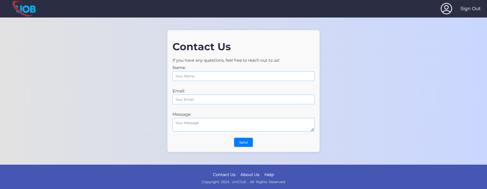
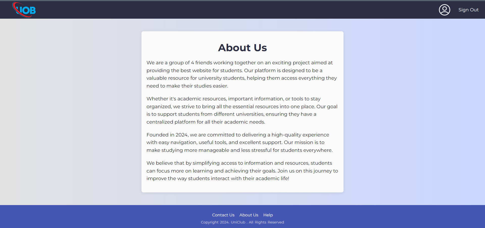
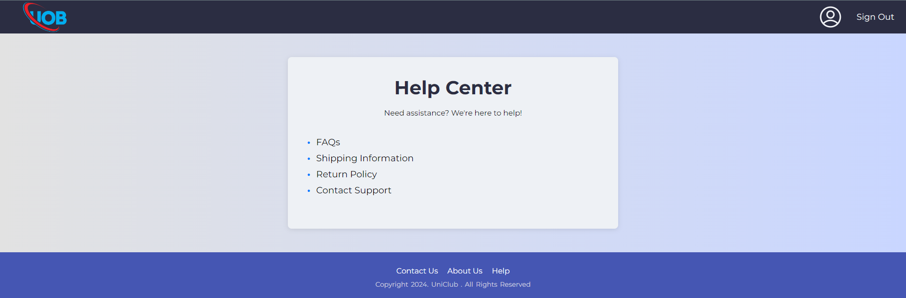
## Difficulties
- Displaying the channels along with their subchannels

## Future enhancements
- Add likes on the posts
- Add search for the posts

## Credits
* Refering to the hoot lab template
* React DOCS
