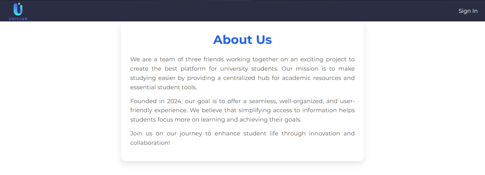

<h1 style="text-align:center;">UniClub</h1>

## Date:12/9/2024

## website description :
UniClub Application is an app developed to allow the users to add channels for university courses, and add comments, posts, details related to each course in order to have a technical community in the university, that everyone can share their added comments, details, and posts with every student in the university.

## Instructions
Before the user signs up or signs in, he can only view the channels and the posts along with the post details in the website, then the user must sign up and then sign in, after that he can view all the added channels and posts along with their details, in addition, he can add channels, he also can add posts in all of the channels along with the details of the post. Finally he can add files and see the files added by the other users. Also, there is a feature that the user can view his profile in order to see his added posts, when he click on the post, it directly takes him to the post details of the post that he clicked on.

## user stories :

- As a user, I should be able to sign in and sign up.
- As a user, I should be able to create channels, and be a moderator. 
- As a user, I should be able to post in each channel.
- As a user, I should be able to add comments in each channel.
- As a user, I should be able to add  files "notes, slides, books, past exams.. etc"
- As a user, I should be able to view all the added comments and details for each course.
- As a user, I should be able to edit and delete the comments and posts that I added.

## Technologies Used
* **MERN Stack**:
  - **MongoDB** – NoSQL database
  - **Express.js** – Web framework for Node.js
  - **React** – Front-end JavaScript library
  - **Node.js** – JavaScript runtime for the back-end
* **CSS** – For styling components and pages
* **Heroku & Vercel** – For deploying backend and frontend
* **Trello** – For project planning and task tracking

 [Trello for planning](https://trello.com/b/PkImCtGH/uniclub)

# Screenshots

## landing page

## Search

## Files / Media / Links 

## User profile

  

# Difficulties
- Managing and displaying nested channels and subchannels in a clear and intuitive UI.
- Handling real-time updates and synchronization between users (e.g., for posts, comments).

# Future Enhancements
- Improve UI/UX across all pages for a more modern look and better accessibility.
- Add real-time chat or discussion feature within each channel.
- Integrate notifications for comments, replies, or post approvals.
- Allow tagging or searching channels by course code or name.
- Add admin panel for easier content moderation and user management.
- Enable dark mode and theme customization.

# Credits
* Built using [React documentation](https://reactjs.org/).
* Planning and task management via [Trello](https://trello.com/b/PkImCtGH/uniclub).

